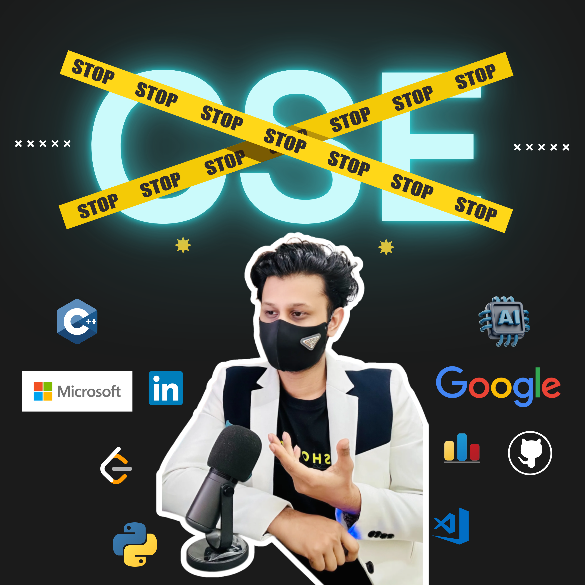

# 🎓 সিএসই প্যাসপোর্ট  🎓 CSE Passport -  The Ultimate Playlist for Every CSE Student in Bangladesh!

  

আপনার CSE লাইফকে সহজ ও সাকসেসফুল করতে চান? তাহলে “CSE পাসপোর্ট 🎓” - আপনার জন্যই!
এখানে আপনি পাবেন CSE স্টুডেন্টদের জন্য ১৫টি সেরা ভিডিও 📚  যেখানে আলোচনা করা হয়েছে —
- ✅ Programming & Skill Roadmaps
- ✅ CGPA vs Skills রিয়েলিটি
- ✅ Research & Scholarship Secrets
- ✅ Laptop Buying Guide (New & Used)
- ✅ Freelancing & Passive Income Tips 💸
- ✅ Govt Jobs & BCS after CSE 🇧🇩
- ✅ Time Management & Productivity হ্যাকস ⏰
- ✅ ATS-Proof CV Masterclass
- ✅ Hackathon & Presentation জিতার টিপস 🏆
- ✅ Zero Experience এ Internship & Job পাওয়ার গাইড
- ✅ ৩য় বর্ষের স্টুডেন্টদের জন্য Career Rebuild Plan

🎥 **YouTube Playlist:** [CSE Roadmaps And Tips](https://youtube.com/playlist?list=PL-dWyZ8prR9WpXyV3ZQMc0DVrzphClHfk&si=0yD46u34ZoonDKCQ)

---

# 📌 Index 
All videos listed below are part of the 📺 *CSE Passport Playlist*  
## 🎥 CSE Passport Playlist (15 Videos)
1. [Complete CSE Roadmap: Programming, Skills, CGPA & Research](#-cse-roadmap-complete-guide-programming-skills-cgpa-research)
2. [Laptop Buying Guide 2026: Coding, AI/ML & Freelancing](#-perfect-laptop-for-cse-students--laptop-for-coding-ai-ml--freelancing--2026-guide)
3. [Used Laptop Buying Guide 💻 Budget & Performance](#used-laptop-buying-guide--used-laptop-কেনার-আগে-এই-ভুলগুলো-avoid-করুন--cs-non-cs)
4. [Non-Coding Tech Careers in 2025](#tech-career-without-coding-in-2025--coding-ছাড়াই-it-ক্যারিয়ার-high-salary-jobs)
5. [Top Books Every CSE Student Must Read](#top-books-every-cse-student-must-read--career-code-soft-skills--financial-freedom)
6. [Government Jobs Guide for CSE Students 🇧🇩](#govt-job-guide-for-cse-students--cse-পড়ে-সরকারি-চাকরি-bcs-থেকে-ব্যাংক-পর্যন্ত-)
7. [CGPA vs Skills 🎯 What Really Matters?](#cgpa-vs-skills--what-is-more-important-for-your-career-সত্যি-কি-cgpa-ম্যাটার-কর)
8. [Time Management & Focus Guide ⏰](#time-management-masterplan-for-cs-and-non-cs-students--productivity-focus-tips)
9. [ATS-Proof CV Masterclass (CS & Non-CS)](#making-a-perfect-cv-masterclass--ai-proof-ats-cv-tips-2025--cs--non-cs)
10. [Side Hustles & Passive Income in 2025](#how-to-make-money-as-a-student-in-2025--৭টি-smart-side-hustle-আইডিয়া)
11. [Career Rebuild Plan for 3rd Year Students](#3rd-year-career-rebuild-plan-for-backbenchers--এক-বছরে-কমব্যাক--cse--non-cs)
12. [Perfect Presentation Masterclass](#how-to-give-a-perfect-presentation--university-presentation-skills-masterclass)
13. [Hackathon Winner Masterclass](#hackathon-winner-masterclass-from-beginner-to-champion-for-cse-students)
14. [Ultimate Research Guide (Thesis + Paper)](#the-ultimate-research-guide-masterclass-for-everyone--zero-to-published-থিসিস-রিসার্চ)
15. [Internship/Job with ZERO Experience](#get-your-first-internship-or-job-with-zero-experience--প্রথম-চাকরি-পাওয়ার-গাইড)

## 📘 Books Collection
1. DSA Books
2. C Pro Books
3. 

## Profile Makeing 
1. CV Template
## ❓ Interview Questions (CS & Tech Jobs)
1. DSA 100 Questions 
## 📝 Handwriting Notes
1. HTML notes
2. CSS notes
3. React Notes
4. Js Notes
## 📝 Languages Test
1. IELTS
2. GMAT
3. GRE
4. DuolingGo
## 📂 Scholarship & Masters Roadmap (BD & Abroad)
1. World ALL Scholership Files
2. Research Proposal
3. Reference letter format
4. Visa Interviews Questions 
5. Letter To Prof
   
---

## 🔥 What’s Inside Playlist

### 📚 CSE Roadmap Complete Guide🔥 Programming, Skills, CGPA, Research, Earning, Scholarship! 
🎓 ৪ বছরের Complete CSE Roadmap (Skill + CGPA + Research + Scholarship Goal)
আপনি যদি একজন বাংলাদেশি CSE Student হন এবং চিন্তায় আছেন:
✅ কোথা থেকে শুরু করবো?
✅ Programming শিখে কিভাবে ইনকাম করবো?
✅ CGPA আর Skills একসাথে কিভাবে ব্যালেন্স করবো?
✅ কিভাবে একটা সুন্দর Portfolio আর LinkedIn Profile বানাবো?
✅ কিভাবে Research করবো আর Masters এর জন্য স্কলারশিপ পাবো?
তাহলে এই ভিডিওটা আপনার জন্য ৪ বছরের একদম ফুল রোডম্যাপ — যা আপনাকে শুরু থেকে প্রফেশনাল লেভেল পর্যন্ত পৌঁছে দেবে ইনশাআল্লাহ। 
[Watch Video ](https://youtu.be/lK47Ebrc39w)

--- 

### 📚 Perfect Laptop For CSE Students 🤯 Laptop for Coding, AI, ML & Freelancing 🔥 2026 Guide 
আপনি যদি একজন CSE Student, Programmer, AI/ML Enthusiast, বা Freelancer হন – এই ভিডিওটি আপনার জন্যই! 💻🔥 এই ভিডিওতে আমি শেয়ার করেছি 2025 সালের জন্য সেরা Laptop Buying Guide,  যেখানে আপনি জানতে পারবেন:
🧠 কোন Laptop টি আপনার জন্য Perfect?
💻 Best Laptop for Coding & Competitive Programming
🤖 AI, Machine Learning, Data Science-এর জন্য Laptop কেমন হওয়া উচিত?
🌐 Freelancing & Remote Job-এর জন্য Efficient Laptop Configuration
⚙️ Processor, RAM, SSD বোঝেন না? তাহলে এই ভিডিও আপনার জন্য!
💥 Best Laptop for Programming & Freelancing 2025 
[Watch Video ](https://youtu.be/jZ35XikMedI) 

---
### Used Laptop Buying Guide 💻 Used Laptop কেনার আগে এই ভুলগুলো Avoid করুন! 🔥 CS Non-CS
কম বাজেটে ভালো পারফরম্যান্সের ল্যাপটপ দরকার? 🖥️ CSE স্টুডেন্ট বা অন্য যেকোনো ব্যাকগ্রাউন্ডের যারা সেকেন্ড হ্যান্ড ল্যাপটপ কিনতে চান, এই ভিডিওটি 100% Practical Guide হিসেবে কাজ করবে! 💡 আমি ভিডিওতে সবকিছু প্র্যাকটিকালি দেখিয়েছি, যেন আপনি ঠকে না যান এবং আপনার বাজেটের মধ্যে best value laptop কিনতে পারেন। 
[Watch](https://youtu.be/ZshkOSznnxk)

---
### Tech Career Without Coding in 2025! 💻 Coding ছাড়াই IT ক্যারিয়ার! High Salary Jobs 
কোডিং বা ম্যাথ ভালো লাগে না? তবু IT ক্যারিয়ার সম্ভব! এই ভিডিওতে শিখুন ২০২৫ সালের সেরা Non-Coding স্কিলগুলো – যেগুলো দিয়ে CS or Non-CS গড়ে তুলতে পারেন হাই ইনকাম ক্যারিয়ার।  
[Watch](https://youtu.be/5dAAUNZpcvE)

---

### Top Books Every CSE Student MUST Read 📚 Career, Code, Soft Skills & Financial Freedom  
Coding জানলেই সব হয় না — একজন সাধারণ CSE স্টুডেন্ট থেকে  একজন টেক লিডার, ইনফ্লুয়েন্সার, আর ফিনান্সিয়ালি ফ্রি মানুষ হতে চাইলে এই ভিডিও তোমার জন্য!  💥   এই ভিডিওতে যা থাকছে:
✅ Clean Code দিয়ে কোডিং স্টাইল উন্নত করো
✅ The Pragmatic Programmer দিয়ে Problem-Solving শেখো
✅ Soft Skills দিয়ে কমিউনিকেশন আর ক্যারিয়ার গড়ো
✅ Deep Work আর Atomic Habits দিয়ে Focus বাড়াও
✅ Rich Dad Poor Dad ও Psychology of Money দিয়ে টাকার হ্যান্ডলিং শেখো
✅ Can’t Hurt Me দিয়ে মেন্টাল স্ট্রেংথ বাড়াও
✅ Powerful Focus দিয়ে distraction দূর করো  
[Watch ](https://youtu.be/7ySrGAIQQVA)

---

### Govt Job Guide for CSE Students 🇧🇩 CSE পড়ে সরকারি চাকরি! BCS থেকে ব্যাংক পর্যন্ত 🔥 
আমাদের দেশে হাজার হাজার শিক্ষার্থী CSE পড়ে বেকার বসে থাকে কারণ তারা জানেই না—সরকারি চাকরিতে কত গুলো পদে তারা Apply করতে পারে। আর যারা জানে, তাদের কাছে নেই একটা Clear Strategy বা Step-by-Step প্ল্যান!  আজকের এই ভিডিও/পোস্টে আমি দেখাবো—কীভাবে CSE ব্যাকগ্রাউন্ড থেকেও সরকারি চাকরি, BCS, ব্যাংক, মন্ত্রণালয়, এমনকি কলেজে Lecturer হওয়া যায়! 🎓 
আজকে আমি শেয়ার করব:
✅ কোন পদে CSE ছাত্ররা আবেদন করতে পারে
✅ সর্বশেষ ৫ বছরের চাকরির সার্কুলারের বিশ্লেষণ
✅ CGPA, অভিজ্ঞতা, স্যালারি কত লাগবে
✅ আর কিভাবে নিজেকে প্রস্তুত করবেন Government ICT Jobs-এর জন্য 🔥 

[Watch ](https://youtu.be/j5qNd8bNTQ0)

---

### CGPA vs. Skills 🔥 What is more important for your career? সত্যি কি CGPA ম্যাটার করে না?
তোমার CGPA কি ৩.০ এর নিচে? আর তুমি ভাবছো — 'দোস্ত, স্কিল আছে তো, চাকরি হয়ে যাবে!' 🤔 কিন্তু একটা কথা বলি... HR-রা কি তোমার GitHub খোলে নাকি CGPA দেখে ফিল্টার করে? 😮 আবার অনেকে তো ৩.৯৫ CGPA নিয়েও বসে আছে — কারণ কোড লিখতে গেলে মাথা ঘুরায়! 🤯
আজকে আমরা কথা বলবো CGPA vs. Skills নিয়ে — কোনটা আসলে বেশি দরকার, আর কোনটা ছাড়া তুমি পিছিয়ে পড়ছো না বুঝেই! 

🔥 ✅ ভিডিওতে যা থাকছে:
CGPA ভালো থাকলে কী সুবিধা?
শুধুমাত্র স্কিল থাকলে কি Job পাওয়া যায়?
তিন ধরনের ছাত্রের রিয়েল ক্যারিয়ার কেস স্টাডি 🎯
CGPA + Real Skills Build করার স্মার্ট টিপস
Secret Study Hacks 🎓 (Lazy Hackers’ Special 😜)
30 দিনে 1টা স্কিল শিখার চ্যালেঞ্জ 💪
AI Tools দিয়ে Learning Hack কিভাবে করবো?

[Watch](https://youtu.be/kg6774DQa9o)

---

### Time Management MasterPlan For CS and Non-CS Students ⏰ Productivity, Focus, Tips 
তোমার সময় কোথায় যাচ্ছে, জানো তো? Code লিখতে গিয়ে ফেসবুক চেক, DSA করার বদলে রিল ভিডিও? Focus নাই? Motivation down? এই ভিডিও তোমার জন্য! কীভাবে নিজের Focus ধরে রেখে, Time waste না করে, Skill build করে ক্যারিয়ারকে অন্য লেভেলে নিয়ে যেতে পারো।  

🔥 Whether you're a CSE Student or from a non-CS background, this is your Ultimate Productivity Roadmap!

✅ Learn how to manage your time like a pro
✅ Stay focused in a world full of distractions
✅ Build habits that future-proof your success 

---

### Making A Perfect CV Masterclass 🔥 AI Proof ATS CV Tips 2025 | CS & Non-CS  
সিভি — এটা শুধু কাগজের একটা টুকরো না। এটা আপনার পরিচয়, আপনার ব্র্যান্ড, আপনার সম্ভাবনা। কিন্তু দুঃখজনক হলেও সত্য, বাংলাদেশের অধিকাংশ  স্টুডেন্ট একটা ভালো সিভি বানাতে জানে না। তোমার CV কি এখনো Reject হচ্ছে? হয়ত তুমি একই ভুল বারবার করছো! ব্যাচেলর, মাস্টার্স, এমনকি পিএইচডি লেভেলের ছেলেমেয়েরাও সিভিতে এমন সব ভুল করে, যেটার কারণে তারা রিজেক্ট হয়ে যায়—কখনো বুঝতেই পারে না কেন। 

এই ভিডিওতে আমি শিখিয়েছি ➤
✅ কীভাবে একটা Perfect CV তৈরি করতে হয়
✅ CV এর Common Mistakes 😓
✅ AI এবং ATS Proof CV বানানোর টেকনিক
✅ Bonus: CSE Students এর জন্য Extra Tips 🎁 

[Watch ](https://youtu.be/G3Wrn0KS644)

---

### How to Make Money as a Student in 2025 💸 ৭টি Smart Side Hustle আইডিয়া 
🎓 ২০২৫ সালে স্টুডেন্টদের জন্য ৭টি Side Hustle আইডিয়া! 💼
হল লাইফে বসে বসে ইনকাম করার কথা ভাবছো? এই ভিডিওতে শেয়ার করলাম এমন ৭টা Side Hustle, যেটা খুবই অল্প বাজেটে শুরু করা যায় — আর পড়াশোনার পাশপাশি সহজেই ম্যানেজ করা যায়!

✅ ৫০০ টাকায় শুরু করা যায় ✅ কোনো স্কিল না থাকলেও চলবে ✅ ২০২৫ সালের জন্য ১০০% রিলেভেন্ট 
📌 এই ভিডিওতে তুমি জানবে:
কিভাবে খুব কম টাকায় বিজনেস শুরু করা যায়
ইউনিভার্সিটি বা হল লাইফে কীভাবে ইনকাম করা যায়
এমন কিছু আইডিয়া, যা একদম Zero থেকে শুরু করা যায়
Time Management সহ অনেক টিপস

[Watch](https://youtu.be/k7ng1tdsUYA)

---

### 3rd Year Career Rebuild Plan for Backbenchers 💯 এক বছরে কমব্যাক 🎯 CSE & Non-CS 
🎓 3rd Year এ আছেন কিন্তু CGPA খারাপ, স্কিল নাই? এই ভিডিওতে আছে এক বছরের ফুল রোডম্যাপ — স্কিল ডেভেলপমেন্ট, স্কলারশিপ প্রিপারেশন, রিমোট জব, এবং নিজের ব্র্যান্ড তৈরির পথ। এক বছরে ক্যারিয়ার রিবুট করে Tech Hero হোন! 🔥 — চাইলেই তুমি জীবনটা বদলে দিতে পারো! 

🔎 এই ভিডিওতে যা থাকছে:
✅ Low CGPA থাকলে কী করা উচিত
✅ 3rd year থেকে একদম নতুনভাবে শুরু করার কৌশল
✅ কোন স্কিলগুলো শেখা সহজ এবং দ্রুত ইনকাম করা সম্ভব
✅ ফোকাস, ডেডিকেশন এবং বাস্তব প্ল্যান
✅ বাংলাদেশের বাস্তবতা অনুযায়ী সাজানো একটি রোডম্যাপ 

[watch ](https://youtu.be/ohnhqD1Wi1E)

---

### How to Give a Perfect Presentation 👨‍🎓 University Presentation Skills Masterclass  
প্রেজেন্টেশন আসলে হলো একটা গল্প। আপনি যদি মানুষকে গল্পে আনতে পারেন, তাহলেই আপনি জিতে গেলেন। তুমি যদি Computer Science অথবা অন্য যেকোনো সাবজেক্টে পড়ো — presentation একদিন না একদিন দিতেই হবে। আর তোমার ক্যারিয়ারে একটা পারফেক্ট প্রেজেন্টেশনই হতে পারে game changer! তাই আজ থেকেই শুরু করো… 

📌 এই ভিডিওতে আপনি শিখবেন:

✅ একজন CSE বা ইউনিভার্সিটি স্টুডেন্ট কীভাবে পারফেক্ট প্রেজেন্টেশন দিবে
✅ কোন কোন ভুলে নাম্বার কমে যায়
✅ নাম্বার বাড়ানোর স্টোরিটেলিং এবং ভিজ্যুয়াল টেকনিক
✅ প্রেজেন্টেশন স্ট্রাকচার, ডিজাইন ও ডেলিভারির A to Z গাইড
✅ লাইভ প্রেজেন্টেশনের সেরা প্র‍্যাকটিস প্ল্যান

[Watch ](https://youtu.be/8THR_vQHfZo)

---

### Hackathon Winner Masterclass: From Beginner to Champion! for CSE Students!
কীভাবে আপনি হ্যাকাথন জিততে পারেন? একেবারে শুরু থেকে! একেবারে শূন্য থেকে তিনটা মেজর ট্রাক সফটওয়্যার, সিকিউরিটি, AI এবং ডাটা সাইন্সের উপরের আয়োজন করা যে কোনো হ্যাকাথন গুলোর অ্যাপ্লিকেশন থেকে উইনার হওয়া পর্যন্ত পরিপূর্ণ মাস্টারক্লাস এটা ..  যদি আপনি একজন CSE Student হন — এবং আপনার জীবনে কিছু Extra করতে চান, এই ভিডিও আপনার জন্য Game Changer হতে পারে!  

🔥 এই ভিডিওতে আপনি শিখবেন —
✅ কীভাবে Zero থেকে Hero হবেন
✅ কোন স্কিল গুলো আপনাকে Hackathon জিততে সাহায্য করবে
✅ কীভাবে বাংলাদেশ বা বিশ্বের যেকোনো Hackathon খুঁজে বের করবেন
✅ আর হ্যাঁ… Hackathon এ জেতার গোপন কৌশল গুলোও জানবেন, যা কেউ বলে না! [Watch ](https://youtu.be/YOJxgMAXEsY)

---

### The Ultimate Research Guide Masterclass for Everyone 📚 Zero to Published! থিসিস রিসার্চ 
বিশ্ববিদ্যালয়ে পড়াশোনা শুরু করলেই একটা শব্দ বারবার কানে আসে — "রিসার্চ" একটা সময় আসে যখন মনে হয়, “রিসার্চ করলে ভালো হতো, CV-ও স্ট্রং হতো, বাইরে স্কলারশিপও পেতাম।” কিন্তু সমস্যাটা হলো, কোথা থেকে শুরু করবো, কী নিয়ে কাজ করবো, কাকে জিজ্ঞেস করবো — কিছুই জানি না! 
আপনি কি ব্যাচেলর শেষ বর্ষের ছাত্র/ছাত্রী? থিসিস আর রিসার্চ পেপার নিয়ে ভয় লাগছে? তাহলে এই ভিডিওটাই আপনার জন্য – শূন্য থেকে অ্যাডভান্স গাইড!

এই ভিডিওতে আপনি শিখবেন:
✅ থিসিস পেপার কী, কেন লাগে, কীভাবে লিখবেন
✅ রিসার্চ পেপার কী, কীভাবে লিখবেন এবং পাবলিশ করবেন
✅ থিসিস বনাম রিসার্চ পেপারের পার্থক্য
✅ টপিক বাছাইয়ের সঠিক কৌশল (Supervisor থাকুক বা না থাকুক)
✅ কীভাবে লিটারেচার রিভিউ করবেন
✅ Conference vs Journal: কোনটা আপনার জন্য
✅ Research Paper vs Survey Paper – কোনটা আগে করবেন
✅ Must-Know Research শব্দগুলো
✅ Paper এর Structure কেমন হওয়া উচিত
✅ টুলস ও রিসোর্স লিস্ট (বিনামূল্যে)

[Watch ](https://youtu.be/iVdPuPCQ4SY) 

---

### Get Your First Internship Or Job with ZERO Experience 🔍 প্রথম চাকরি পাওয়ার গাইড

কোনো পূর্ব অভিজ্ঞতা ছাড়াই কীভাবে প্রথম ইন্টার্নশিপ বা চাকরি পাবেন?   এই ভিডিওতে আমি শেয়ার করছি আমার Step-by-Step রোডম্যাপ, যেটা ফলো করলে আপনি স্কিল শিখে, প্রজেক্ট বানিয়ে, LinkedIn ও CV ব্যবহার করে একদম শুরু থেকে চাকরি বা ইন্টার্নশিপ পেতে পারেন....
বিশেষ করে আপনি যদি Computer Science পড়েন কিন্তু প্রতিযোগিতামূলক (competitive) নন, কিংবা Programming Olympiad বা বড় বড় হ্যাকাথনে অংশ না নিয়ে থাকেন, তাহলে আপনার প্রথম চাকরির রাস্তাটা অনেক সময় কণ্টকাকীর্ণ হতে পারে।
তবে ভয় নেই – সঠিক পরিকল্পনা, কিছু স্মার্ট টেকনিক, এবং সঠিক প্রস্তুতি থাকলে ইন্টার্নশিপ বা অভিজ্ঞতা ছাড়াই আপনার প্রথম চাকরি পাওয়া সম্ভব। চলুন খেলার মতো ধাপে ধাপে জানি কিভাবে!
[Watch ](https://youtu.be/oW8mhlmfXpY) 

--- 
